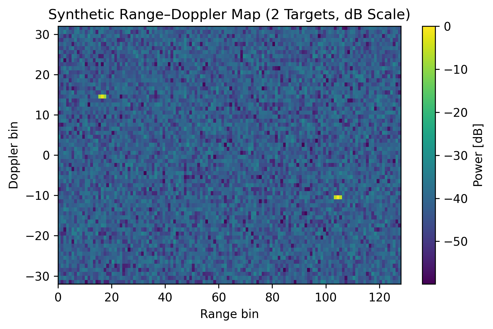
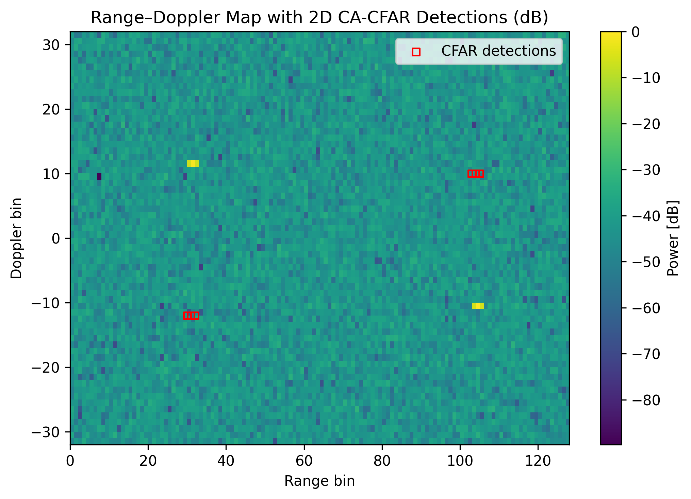

# Radar–Camera Fusion and CFAR Target Detection

A complete Python simulation of radar signal processing and adaptive target detection inspired by real-world sports-tracking systems.

## 🎯 Project Overview
This project models the essential components of a radar–vision fusion system:
- Synthetic radar signal generation.
- 2-D FFT range–Doppler processing.
- Visualization of power maps (linear and dB scale).
- Adaptive detection using 2-D Cell-Averaging CFAR (CA-CFAR).
- (Optional) Multi-target tracking and radar–camera fusion.

It is designed as an educational and research-level reference for those interested in **signal processing**, **sensor fusion**, and **algorithmic prototyping**.

---

## ⚙️ Installation
```bash
conda create -n radar python=3.11
conda activate radar
pip install numpy matplotlib scipy
```

## ▶️ Run Demo
```bash
python notebooks/radar_signal_chain_advanced.py

python notebooks/radar_signal_chain_cfar.py
```
## 📊 Results

### Synthetic Range–Doppler Map


The bright peaks correspond to simulated moving targets. The color intensity represents reflected power in dB scale.

---

### CA-CFAR Detection


Red boxes mark cells that exceeded the adaptive CFAR threshold — both targets were successfully detected while maintaining a low false-alarm rate.
